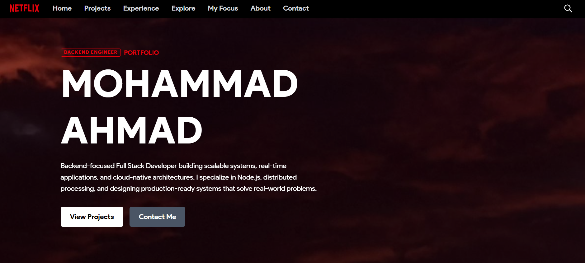

# 🎬 Ahmad Netflix-Style Portfolio

A modern, responsive **Netflix-inspired developer portfolio** built to showcase my projects, experience, and technical skills in a visually engaging and production-ready format.

🚀 **Live Demo:** https://ahmad-netflix-portfolio-ujir.vercel.app/

---

## 📸 Preview



---

## 👨‍💻 About Me

Hi, I'm **Mohammad Ahmad**, a backend-focused Full Stack Developer passionate about building scalable systems, real-time applications, and cloud-native architectures.

* 💻 Backend: Node.js, Express, APIs, Distributed Systems
* ⚡ Frontend: React, Next.js, Tailwind CSS
* ☁️ Exploring: Cloud, DevOps, System Design
* 🧠 Focus: Problem Solving (DSA) + Production-ready systems

---

## ✨ Features

* 🎥 **Netflix-inspired UI/UX**
* 📱 Fully **responsive design** (mobile + desktop)
* 📊 GitHub profile integration & analytics
* 🚀 Featured projects with real-world impact
* 🧩 Clean modular component architecture
* ⚡ Optimized performance with Next.js

---

## 🛠️ Tech Stack

* **Frontend:** Next.js, React, Tailwind CSS
* **Backend Concepts:** REST APIs, System Design
* **Tools & Platforms:** Git, Docker, Vercel
* **Languages:** JavaScript, TypeScript

---

## 📂 Project Highlights

### 🔹 Codemia

> Scalable automated coding platform with multi-language execution

* ⚡ Reduced execution latency by 50%
* 🧠 Parallel processing using BullMQ + Redis
* 🔧 Built with Node.js, Express, Supabase

---

### 🔹 AI Resume Builder

> AI-powered resume optimization tool

* 📄 Improves ATS score
* 🤖 Smart content generation
* ⚡ Fast and user-friendly UI

---

## 🚀 Getting Started

### 1. Clone the repo

```bash
git clone https://github.com/Bitsnbytes14/ahmad-netflix-portfolio.git
cd ahmad-netflix-portfolio
```

### 2. Install dependencies

```bash
npm install
```

### 3. Run locally

```bash
npm run dev
```

---

## 🌐 Deployment

This project is deployed on **Vercel**.

To deploy your own:

1. Push code to GitHub
2. Import project in Vercel
3. Click Deploy 🚀

---

## 🤝 Connect With Me

* 🔗 GitHub: https://github.com/Bitsnbytes14
* 💼 LinkedIn: https://www.linkedin.com/in/mohammad-ahmad141004

---

## ⭐ Show Your Support

If you like this project, consider giving it a ⭐ on GitHub!

---

## 📌 Future Improvements

* Add animations (Framer Motion)
* Dark/Light theme toggle
* Blog integration
* Backend analytics dashboard

---

> Built with ❤️ using Next.js & Tailwind CSS
